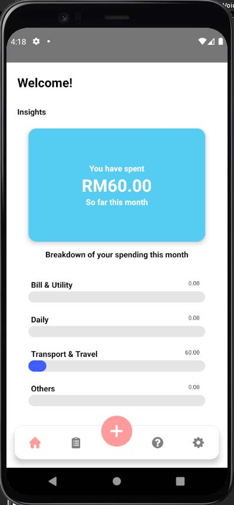
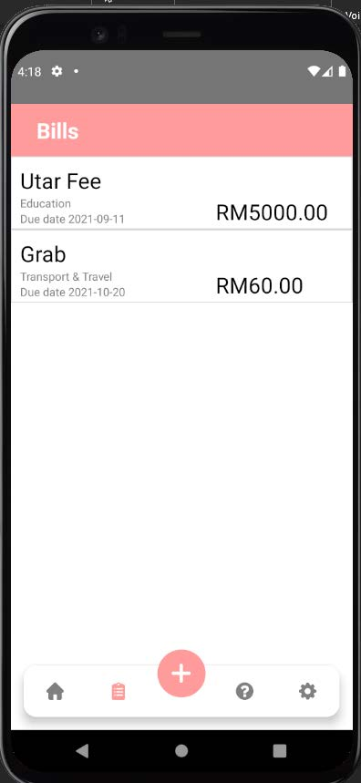
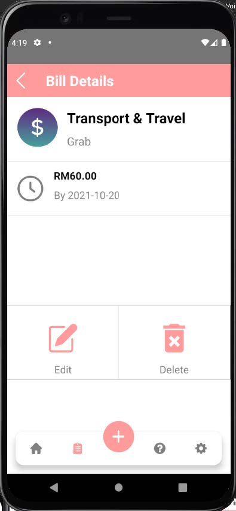
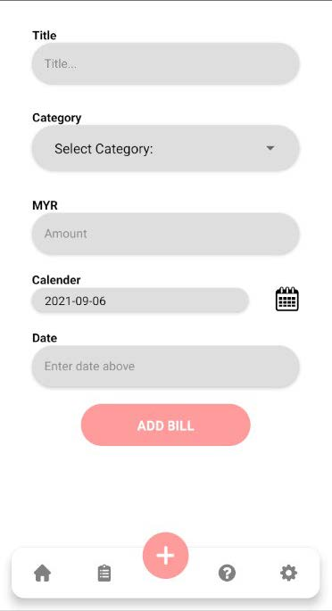
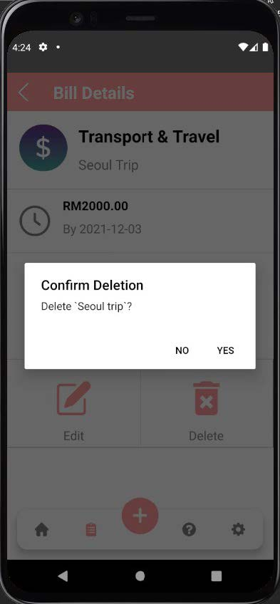
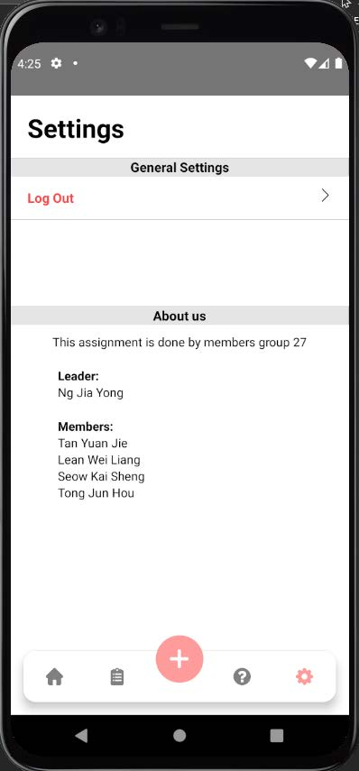

# BillBell

## Overview
This is a mobile financial management application that helps users to manage their bills. The main functions of this application include the followings:
1. Registration
2. Login
3. View All Bills
4. View Bill Details
5. Add Bill
6. Edit Bills
7. Delete Bills

## Tech Stack
1. React Native
2. Firebase

## Installation Steps
1. Install the packages using npm.
	```
  npm i
  ```
2. Create SQLite database by running the `createdb.py`.
	```
  python createdb.py
  ```
3. Refer to the [link](https://www.npmjs.com/package/react-native-sqlite-storage) to setup SQLite storage.
4. Run the application using Android emulator or IOS emulator.
	```
	react-native run-android
	react-native run-ios
	```

## Preview
1. Register <br> <br><br>
2. Login <br> <br><br>
3. Home <br> <br><br>
4. View All Bills <br> <br><br>
5. View Bill <br> <br><br>
6. Add Bill <br> <br><br>
7. Delete Bill <br> <br><br>
8. Settings <br> <br><br>
